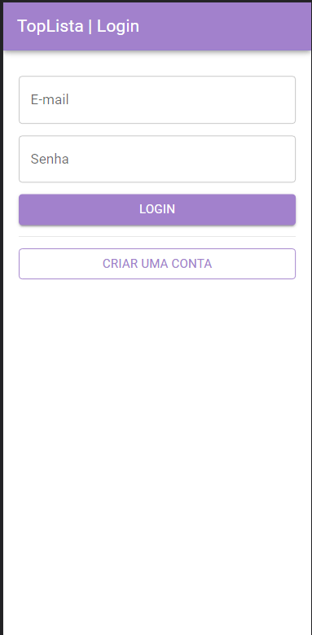
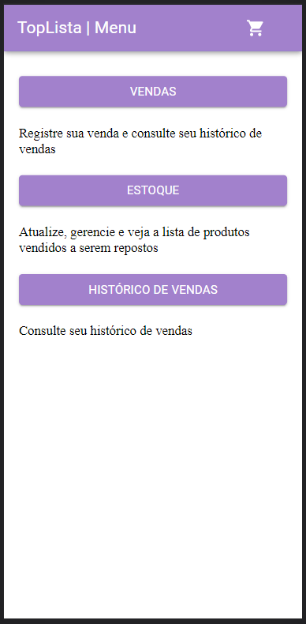
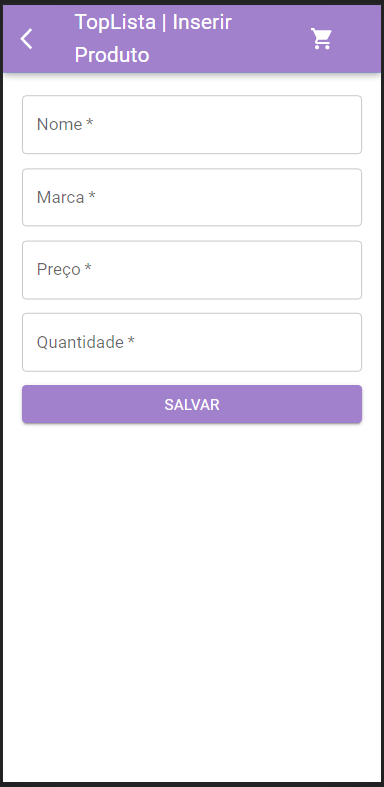
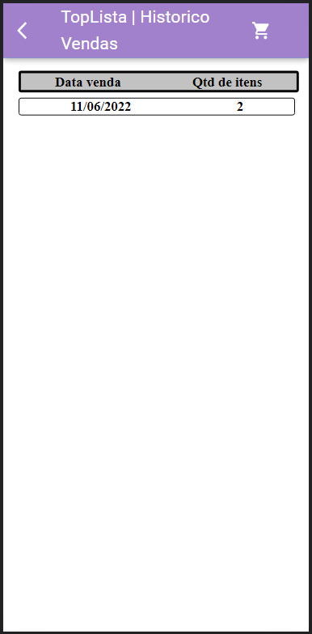
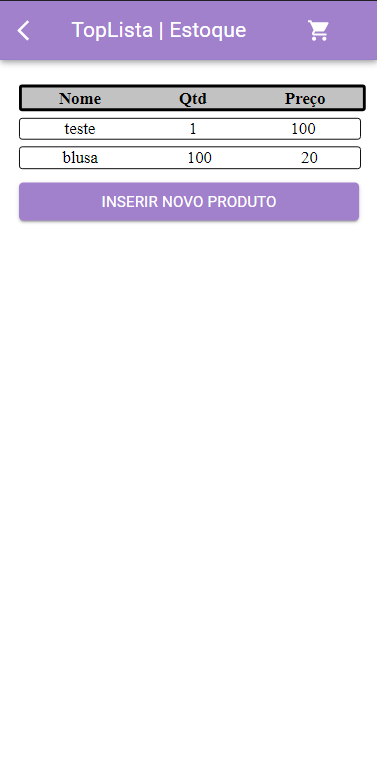
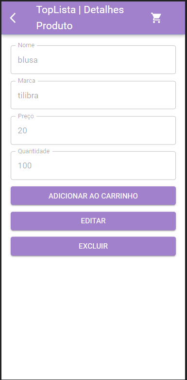

# TopLista - Projeto de desenvolvimento Mobile

Projeto para a matéria de desenvolvimento Mobile de André Chierighini (RA-171340) e Camila de Carvalho Mendes (RA-171660), o qual é uma lista de compras com diversas funções para o usuário organizar-se na hora de fazer compras.

[Vídeo de apresentação](https://youtu.be/O0bHSgZ64N0)

## Descrição
A TopLista é um aplicativo cuja funcionalidade é de guardar produtos a serem comprados pelo usuário.

Ela é capaz de armazenar  em banco de dados listas de produtos criados pelo usuário e listas de compras compostas por estes produtos, além de um estoque de produtos.

## Principais Telas

## Instruções
É necessário ter [NodeJS](https://nodejs.org/) instalado na máquina. E instalar o `expo-cli` utilizando `npm install --global expo-cli@4.7.2`
### Back-end
Para rodar o back-end é necessário utilizar os comandos:
* `npm install`
* `npx prisma migrate dev`
* `npx prisma generate`
* `npm run dev`

### Front-end
Para rodar o front-end é necessário utilizar os comandos:
* `npm install`
* `npm start ou expo start`
* Após a abertura da interface gráfica do projeto, é necessário selecionar o modo `LAN`.